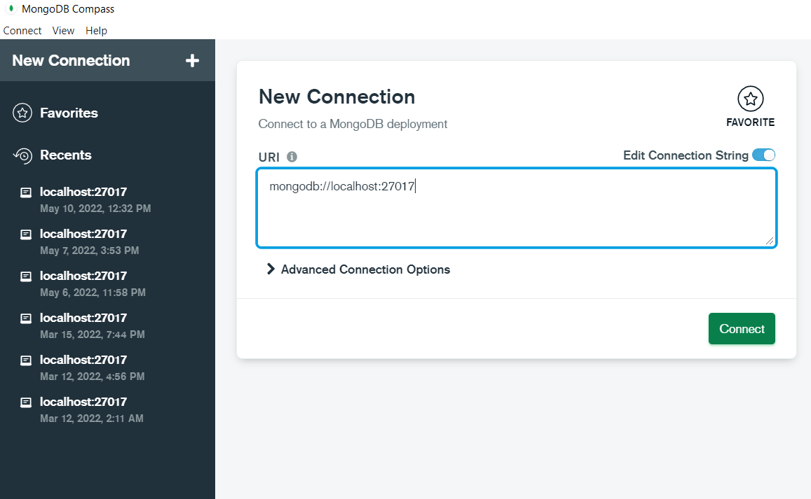
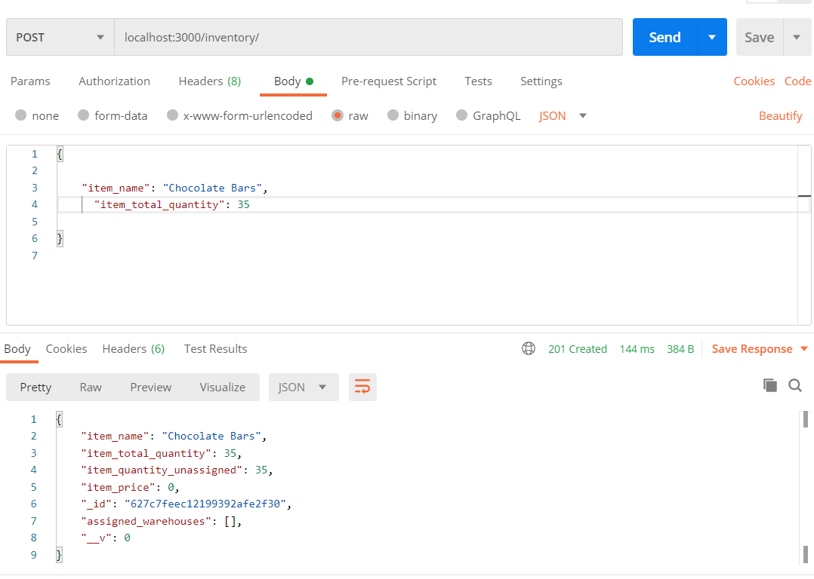

# shopify-2022-backend-challenge

This is my technical challenge submission for Shopify's 2022 backend engineering position

## Setting up

- Node.js
- [MongoDB (Community Edition)](https://www.mongodb.com/docs/manual/administration/install-community/)
- [MongoDB (Compass for simiplicity)](https://www.mongodb.com/try/download/compass)
- NOTE: In a production environment I would be using a MongoDB Atlas cluster but for local development I am using local Mongo databases

To run the app:

- Clone the repository https://github.com/SahilHakimiUofT/shopify-2022-backend-challenge.git
- Get Mongo running locally, if you don't already have that setup https://www.mongodb.com/docs/manual/tutorial/install-mongodb-on-windows/
- Connect to MongoDB Compass with the URI, mongodb://localhost:27017, you can also connect with MongoDB Shell if you prefer
  
- Change directory to `server` and install all the dependencies with `npm install`
- You can start the server now with `npm start`
- The app will listen in on port 3000 unless you choose to create a .env file
- ## Optional Setup
- Change directory to server and create a file called .env
- you can fill in the .env like so, with whichever PORT you choose other than 27017 (specified port for mongo)

```
PORT=3000
```

## Functionality and Chosen additional feature

- Users can create, edit, delete by id, view by id, and view a list of all inventory items
- My chosen feature is allowing users to create warehouses and assign inventory to them

### Inventory

- The inventory model is set up like so

```
item_name:String //required
item_total_quantity:Number //required and must be >=0
item_quantity_unassigned:Number //tracks free inventory not assigned to a warehouse
item_sku:String //allows users to put in a sku if they have one
item_price:Number
assigned_warehouses:[{warehouse:ObjectId,quantity_assigned:Number}]//Tracks all the warehouses this item has inventory assigned to and how much
```

### Warehouses

- The warehouse model is set up like so

```
warehouse_name:String //required
province:String //required
address:String //required
country:String //required
city:String //required
inventory: [{item:ObjectId,quantity:Number}] //tracks all items assigned to warehouse and how much
```

## Endpoint Manual

### Inventory endpoints

- Users can get all inventory items with `GET /inventory` with nothing in the request body, response will be an array of all the inventory item objects
- Users can get a specific inventory item in the response with `GET /inventory/:id`, if the id is valid the item will be returned, otherwise an error will be returned
- Users can create an inventory item with `POST /inventory`, in the JSON request body they need to have item_name, item_total_quantity. The optional fields are item_price and item_sku. If the request is valid the new item will be in the response, otherwise errors will be
- Users can edit a specific inventory item with `PUT /inventory/:id`and in the JSON request body they can have item_name, item_total_quantity (above 0, and if lowering the total quantity item_quantity_unassigned has to be greater than 0), item_price, item_sku, if the id and body is valid, the updated item will be in the response, otherwise an error
- Users can delete a specific inventory item with `DELETE /inventory/:id` with the id being a valid id for an inventory item in the Mongo Database, if the id is valid the response status will be 200, otherwise an error will be returned

### Warehouse Endpoints

- User can get a list of all the warehouses with `GET /warehouse` with nothing in the request body, an array of all warehouse objects will be in the response
- User can create a warehouse with `POST /warehouse` and in the JSON request they must have warehouse_name, province,city,country,address, if the request is valid and successful, the new warehouse object will be in the response , otherwise errors will be
- User can add inventory to a warehouse with `PUT /warehouse/:id` and in the JSON request they must include a valid item_id, and a quantity > 0 (if the item does not have enough unassigned quantity errors will be returned). If the request is valid, the response status code 200 , otherwises errors will be returned

Here is an example of a successful API request with the server running on port 3000

# TESTING

To run test scripts that I've created with jest and supertest, just changed directory into server and run`npx jest`, make sure that the mongodb compass connection is still on for this, the tests populate a test database but they will clear the data on completion

# Considerations for the Future

Allowing multiple inventory items to be added to a warehouse at once
Giving inventory items a status (i.e: at warehouse, en route)
Allowing inventory to be sent from 1 warehouse to another

# Aknowledgements

- [Youtube Jest tutorial by : Sam Meech-Ward](https://www.youtube.com/watch?v=FKnzS_icp20)
- [Jest documentation](https://jestjs.io/docs/)
- [Setting up mock database for Jest](https://zellwk.com/blog/jest-and-mongoose/)
